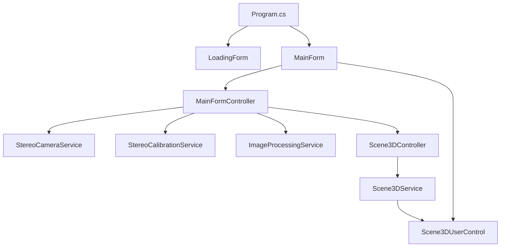
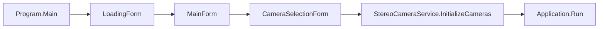
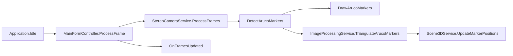
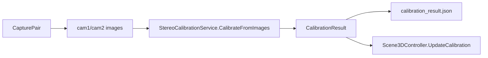
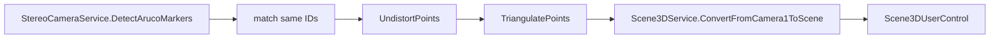

# Документация проекта StereoCalibration

Проект написан на C# под `.NET 8 Windows` и объединяет:

- WinForms для основного интерфейса, выбора камер и загрузочного окна.
- WPF через `ElementHost` для 3D-сцены.
- HelixToolkit.Wpf для 3D-визуализации.
- OpenCvSharp для работы с камерами, шахматной доской, ArUco и стереокалибровкой.
- Newtonsoft.Json для сохранения/загрузки результата калибровки.

## Общая архитектура

Слои приложения:

- UI: `Program`, `LoadingForm`, `MainForm`, `CameraSelectionForm`, `Scene3DUserControl`.
- Контроллеры: `MainFormController`, `Scene3DController`.
- Сервисы камер и обработки: `StereoCameraService`, `CameraManager`, `CameraPreviewService`, `ImageProcessingService`.
- Сервисы калибровки и сцены: `StereoCalibrationService`, `Scene3DService`, `ArucoDetectionProfile`.
- Данные: `CalibrationResult`, `MarkerCoordinate`, `calibration_result.json`.

## Потоки данных

### Запуск приложения

Где смотреть:

- Точка входа: `Program`, `Main` в `calibr/Program.cs:13`, `calibr/Program.cs:16`.
- Загрузочный экран: `LoadingForm` в `calibr/LoadingForm.cs:16`, обновление прогресса `SetProgress` в `calibr/LoadingForm.cs:75`.
- Главное окно: `MainForm` в `calibr/MainForm.cs:27`, конструктор с splash screen в `calibr/MainForm.cs:105`.
- Выбор камер: `CameraSelectionForm` в `calibr/Form1.cs:23`, конструктор в `calibr/Form1.cs:88`.

### Основной видеопоток

Где смотреть:

- Подключение `Application.Idle`: `MainForm.StartButton_Click` в `calibr/MainForm.cs:712`.
- Делегирование кадра контроллеру: `MainForm.ProcessFrame` в `calibr/MainForm.cs:728`.
- Полный цикл кадра: `MainFormController.ProcessFrame` в `calibr/Controllers/MainFormController.cs:166`.
- Чтение кадров: `StereoCameraService.ProcessFrames` в `calibr/Services/StereoCameraService.cs:141`.
- Отправка Bitmap в UI: `OnFramesUpdated` в `calibr/Controllers/MainFormController.cs:20`.

### Калибровка

Где смотреть:

- Захват пары: `MainFormController.CapturePair` в `calibr/Controllers/MainFormController.cs:268`.
- Старт калибровки: `MainFormController.StartCalibration` в `calibr/Controllers/MainFormController.cs:347`.
- Чтение изображений из папок: `StereoCalibrationService.CalibrateFromImages` в `calibr/Services/StereoCalibrationService.cs:77`.
- Поиск шахматной доски: `ProcessChessboardImages` в `calibr/Services/StereoCalibrationService.cs:148`.
- Индивидуальная и стереокалибровка OpenCV: `PerformStereoCalibration` в `calibr/Services/StereoCalibrationService.cs:231`.
- Сохранение/загрузка JSON: `SaveCalibrationResult` и `LoadCalibrationResult` в `calibr/Services/StereoCalibrationService.cs:345`, `calibr/Services/StereoCalibrationService.cs:354`.

### ArUco, триангуляция и 3D

Где смотреть:

- Профиль ArUco: `ArucoDetectionProfile` в `calibr/Services/ArucoDetectionProfile.cs:12`.
- Детект с памятью/ROI: `StereoCameraService.DetectMarkersWithFallback` в `calibr/Services/StereoCameraService.cs:304`.
- ROI fallback: `TryDetectMarkerInRoi` и `TryBuildMarkerRoi` в `calibr/Services/StereoCameraService.cs:372`, `calibr/Services/StereoCameraService.cs:407`.
- Сопоставление одинаковых ID: `ImageProcessingService.TriangulateArucoMarkers` в `calibr/Services/ImageProcessingService.cs:46`.
- Триангуляция 4 углов: `TriangulateMarker` в `calibr/Services/ImageProcessingService.cs:134`.
- Преобразование координат в 3D-сцену: `ConvertFromCamera1ToScene` в `calibr/Services/Scene3DService.cs:417`.
- Визуализация маркеров: `Scene3DUserControl.UpdateMarkers` в `calibr/UI/Scene3DUserControl.xaml.cs:950`.
- Поверхность по маркерам: `UpdateMarkerSurface`, `BuildMarkerSurfaceMesh`, `BuildDelaunayTriangles` в `calibr/UI/Scene3DUserControl.xaml.cs:1242`, `calibr/UI/Scene3DUserControl.xaml.cs:1322`, `calibr/UI/Scene3DUserControl.xaml.cs:1359`.

## Координатные системы

Триангуляция возвращает координаты в системе первой камеры. Это удобно для OpenCV, но неудобно для визуальной сцены, где нужно видеть две камеры относительно общего центра.

Преобразование выполняет `Scene3DService`:

- `CalculateSecondCameraCenter` (`calibr/Services/Scene3DService.cs:308`) вычисляет центр второй камеры по формуле `C2 = -R^T * T`.
- `BuildSceneBasis` (`calibr/Services/Scene3DService.cs:329`) строит визуальные оси: X вдоль базовой линии, Y вперёд по общей зоне обзора, Z вверх.
- `ConvertFromCamera1ToScene` (`calibr/Services/Scene3DService.cs:417`) смещает точку относительно центра стереопары и проецирует её на оси сцены.

## Подробный справочник по классам

### `Program`

Файл: `calibr/Program.cs`.

Назначение: точка входа приложения.

Ключевые элементы:

- `Program` — `calibr/Program.cs:13`.
- `Main` — `calibr/Program.cs:16`.

Что делает:

- включает WinForms visual styles;
- показывает `LoadingForm`;
- создаёт `MainForm`;
- завершает приложение, если старт отменён при выборе камер;
- запускает главный цикл `Application.Run(mainForm)`.

### `LoadingForm`

Файл: `calibr/LoadingForm.cs`.

Назначение: splash screen с изображением `loading.png`, прогрессом и статусом.

Ключевые элементы:

- `LoadingForm` — `calibr/LoadingForm.cs:16`.
- Конструктор — `calibr/LoadingForm.cs:21`.
- `SetProgress` — `calibr/LoadingForm.cs:75`.

Особенность: `SetProgress` вызывает `Application.DoEvents`, чтобы окно успевало перерисоваться во время синхронной инициализации.

### `MainForm`

Файл: `calibr/MainForm.cs`.

Назначение: главное окно приложения. Содержит вкладку камер, вкладку 3D-сцены, таблицу 3D-координат справа и кнопки управления.

Ключевые элементы:

- Класс `MainForm` — `calibr/MainForm.cs:27`.
- Конструкторы — `calibr/MainForm.cs:101`, `calibr/MainForm.cs:105`.
- `SetupControllerEvents` — `calibr/MainForm.cs:145`.
- `Initialize3DScene` — `calibr/MainForm.cs:233`.
- `InitializeCamerasWithController` — `calibr/MainForm.cs:275`.
- `UpdateMarkerInfoTable` — `calibr/MainForm.cs:374`.
- `InitializeComponent` — `calibr/MainForm.cs:406`.
- `LayoutCamerasTab` — `calibr/MainForm.cs:606`.
- `StartButton_Click` — `calibr/MainForm.cs:712`.
- `RestartButton_Click` — `calibr/MainForm.cs:760`.
- `OnFormClosed` — `calibr/MainForm.cs:797`.

- WinForms UI обновляется через события контроллера.
- Для 3D используется WPF `Scene3DUserControl`, встроенный через `ElementHost`.
- На основной вкладке таблица справа показывает 3D-координаты, чтобы не перекрывать видеопотоки.
- Кнопка перезапуска запускает `dotnet build && dotnet run`.

### `CameraSelectionForm`

Файл: `calibr/Form1.cs`.

Назначение: окно выбора двух камер и предпросмотра перед запуском основного окна.

Ключевые элементы:

- Класс `CameraSelectionForm` — `calibr/Form1.cs:23`.
- Конструктор — `calibr/Form1.cs:88`.
- `StartPreviewCamera1Async` — `calibr/Form1.cs:286`.
- `StopPreviewCamera1` — `calibr/Form1.cs:386`.
- `StartPreviewCamera2Async` — `calibr/Form1.cs:444`.
- `StopPreviewCamera2` — `calibr/Form1.cs:534`.
- `Timer_Tick` — `calibr/Form1.cs:576`.
- `UpdatePreview` — `calibr/Form1.cs:594`.
- `btnApply_Click` — `calibr/Form1.cs:627`.
- `OnFormClosing` — `calibr/Form1.cs:691`.
- `InitializeComponent` — `calibr/Form1.cs:797`.

Техническая особенность: файл называется `Form1.cs`, но реальный класс — `CameraSelectionForm`. Предпросмотр реализован автономно через `VideoCapture`, поэтому форма тщательно освобождает камеры при закрытии.

### `MainFormController`

Файл: `calibr/Controllers/MainFormController.cs`.

Назначение: центральный координатор приложения между UI и сервисами.

Ключевые элементы:

- Класс — `calibr/Controllers/MainFormController.cs:20`.
- Конструктор — `calibr/Controllers/MainFormController.cs:74`.
- `ProcessFrame` — `calibr/Controllers/MainFormController.cs:166`.
- `ProcessChessboardDetection` — `calibr/Controllers/MainFormController.cs:219`.
- `CapturePair` — `calibr/Controllers/MainFormController.cs:268`.
- `StartCalibration` — `calibr/Controllers/MainFormController.cs:347`.
- `LoadExistingCalibration` — `calibr/Controllers/MainFormController.cs:377`.
- `FormatCalibrationResult` — `calibr/Controllers/MainFormController.cs:401`.
- `Dispose` — `calibr/Controllers/MainFormController.cs:457`.

Что делает:

- управляет `StereoCameraService`, `StereoCalibrationService`, `ImageProcessingService`, `Scene3DController`;
- читает кадры;
- запускает ArUco-детекцию;
- запускает триангуляцию при наличии калибровки;
- рисует шахматную доску для визуального контроля;
- отправляет Bitmap в `MainForm`;
- отправляет 3D-позиции в сцену и таблицу.

### `Scene3DController`

Файл: `calibr/Controllers/Scene3DController.cs`.

Назначение: фасад над `Scene3DService`.

Ключевые элементы:

- Класс — `calibr/Controllers/Scene3DController.cs:11`.
- `UpdateCalibration` — `calibr/Controllers/Scene3DController.cs:49`.
- `UpdateMarker` — `calibr/Controllers/Scene3DController.cs:72`.
- `UpdateMarkers` — `calibr/Controllers/Scene3DController.cs:87`.
- `RemoveMarker` — `calibr/Controllers/Scene3DController.cs:103`.
- `ClearAllMarkers` — `calibr/Controllers/Scene3DController.cs:111`.
- `IsSceneReady` — `calibr/Controllers/Scene3DController.cs:119`.
- `GetSceneInfo` — `calibr/Controllers/Scene3DController.cs:127`.
- `ResetScene` — `calibr/Controllers/Scene3DController.cs:135`.
- `LogCurrentPositions` — `calibr/Controllers/Scene3DController.cs:144`.

### `ArucoDetectionProfile`

Файл: `calibr/Services/ArucoDetectionProfile.cs`.

Назначение: единый источник настроек ArUco-детектора.

Ключевые элементы:

- Класс — `calibr/Services/ArucoDetectionProfile.cs:12`.
- `CreateDictionary` — `calibr/Services/ArucoDetectionProfile.cs:18`.
- `CreateParameters` — `calibr/Services/ArucoDetectionProfile.cs:29`.

Что важно: все части приложения используют один словарь `Dict6X6_250` и один набор `DetectorParameters`.

### `StereoCameraService`

Файл: `calibr/Services/StereoCameraService.cs`.

Назначение: низкоуровневый сервис стереопары.

Ключевые элементы:

- Класс — `calibr/Services/StereoCameraService.cs:18`.
- `InitializeCameras` — `calibr/Services/StereoCameraService.cs:65`.
- `ProcessFrames` — `calibr/Services/StereoCameraService.cs:141`.
- `CapturePair` — `calibr/Services/StereoCameraService.cs:157`.
- `DetectArucoMarkers` — `calibr/Services/StereoCameraService.cs:194`.
- `DrawArucoMarkers` — `calibr/Services/StereoCameraService.cs:237`.
- `DetectMarkersWithFallback` — `calibr/Services/StereoCameraService.cs:304`.
- `TryDetectMarkerInRoi` — `calibr/Services/StereoCameraService.cs:372`.
- `TryBuildMarkerRoi` — `calibr/Services/StereoCameraService.cs:407`.
- `RememberedMarker` — `calibr/Services/StereoCameraService.cs:497`.
- `DetectedMarker` — `calibr/Services/StereoCameraService.cs:514`.

- сначала всегда выполняется детект на полном кадре;
- если маркер пропал, пробуется ROI вокруг прошлого положения;
- если ROI не помог, маркер кратко удерживается как stale;
- stale-маркер отмечается маленькой оранжевой точкой;
- сервис возвращает 2D corners/ids, но не считает 3D.

### `ImageProcessingService`

Файл: `calibr/Services/ImageProcessingService.cs`.

Назначение: 3D-триангуляция ArUco-маркеров.

Ключевые элементы:

- Класс — `calibr/Services/ImageProcessingService.cs:17`.
- `TriangulateArucoMarkers` — `calibr/Services/ImageProcessingService.cs:46`.
- `TriangulateMarker` — `calibr/Services/ImageProcessingService.cs:134`.
- `CreateMatrixFromArray` — `calibr/Services/ImageProcessingService.cs:247`.
- `CreateVectorFromArray` — `calibr/Services/ImageProcessingService.cs:263`.

- маркеры сопоставляются по одинаковому ArUco ID в двух камерах;
- перед триангуляцией углы проходят `UndistortPoints`;
- матрицы проекции: `P1 = [I|0]`, `P2 = [R|T]`;
- триангулируются четыре угла, а не один 2D-центр;
- результат остаётся в системе координат первой камеры.

### `StereoCalibrationService`

Файл: `calibr/Services/StereoCalibrationService.cs`.

Назначение: калибровка камер по шахматной доске.

Ключевые элементы:

- Класс — `calibr/Services/StereoCalibrationService.cs:23`.
- `CalibrateFromImages` — `calibr/Services/StereoCalibrationService.cs:77`.
- `ProcessChessboardImages` — `calibr/Services/StereoCalibrationService.cs:148`.
- `ConvertMatListsToPointLists` — `calibr/Services/StereoCalibrationService.cs:196`.
- `PerformStereoCalibration` — `calibr/Services/StereoCalibrationService.cs:231`.
- `MatToArray2D` — `calibr/Services/StereoCalibrationService.cs:308`.
- `MatToArray1D` — `calibr/Services/StereoCalibrationService.cs:322`.
- `SaveCalibrationResult` — `calibr/Services/StereoCalibrationService.cs:345`.
- `LoadCalibrationResult` — `calibr/Services/StereoCalibrationService.cs:354`.
- `CalibrationResult` — `calibr/Services/StereoCalibrationService.cs:372`.

- калибровка перечитывает пары изображений из `cam1/{folder}` и `cam2/{folder}`;
- нужно минимум 10 пар с найденной шахматной доской;
- сначала выполняется индивидуальная калибровка камер;
- затем `StereoCalibrate` вычисляет R, T, E, F;
- результат сохраняется как JSON.

### `Scene3DService`

Файл: `calibr/Services/Scene3DService.cs`.

Назначение: модель 3D-сцены и координатная математика.

Ключевые элементы:

- Класс — `calibr/Services/Scene3DService.cs:22`.
- `UpdateCameraPositions` — `calibr/Services/Scene3DService.cs:88`.
- `UpdateMarkerPosition` — `calibr/Services/Scene3DService.cs:153`.
- `UpdateMarkerPositions` — `calibr/Services/Scene3DService.cs:184`.
- `RemoveMarker` — `calibr/Services/Scene3DService.cs:232`.
- `ClearMarkers` — `calibr/Services/Scene3DService.cs:246`.
- `GetMarkerDisplayName` — `calibr/Services/Scene3DService.cs:257`.
- `GetSceneInfo` — `calibr/Services/Scene3DService.cs:267`.
- `Reset` — `calibr/Services/Scene3DService.cs:283`.
- `CalculateSecondCameraCenter` — `calibr/Services/Scene3DService.cs:308`.
- `BuildSceneBasis` — `calibr/Services/Scene3DService.cs:329`.
- `TransformCamera2DirectionToCamera1` — `calibr/Services/Scene3DService.cs:399`.
- `ConvertFromCamera1ToScene` — `calibr/Services/Scene3DService.cs:417`.
- `GetSmoothedMarkerPosition` — `calibr/Services/Scene3DService.cs:447`.
- `RegisterDisplayIndices` — `calibr/Services/Scene3DService.cs:484`.

Что важно объяснить:

- OpenCV даёт `R,T` как переход между системами камер;
- центр второй камеры вычисляется через `-R^T*T`;
- визуальная сцена имеет собственный базис;
- маркеры сглаживаются;
- маркеры не удаляются сразу, а удерживаются несколько кадров.

### `Scene3DUserControl` и `MarkerCoordinate`

Файл: `calibr/UI/Scene3DUserControl.xaml.cs`.

Назначение: WPF/HelixToolkit UI 3D-сцены.

Ключевые элементы:

- `MarkerCoordinate` — `calibr/UI/Scene3DUserControl.xaml.cs:18`.
- `Scene3DUserControl` — `calibr/UI/Scene3DUserControl.xaml.cs:126`.
- Конструктор — `calibr/UI/Scene3DUserControl.xaml.cs:179`.
- `InitializeComponent` — `calibr/UI/Scene3DUserControl.xaml.cs:192`.
- `InitializeScene` — `calibr/UI/Scene3DUserControl.xaml.cs:491`.
- `BindToService` — `calibr/UI/Scene3DUserControl.xaml.cs:785`.
- `UpdateScene` — `calibr/UI/Scene3DUserControl.xaml.cs:813`.
- `UpdateCameras` — `calibr/UI/Scene3DUserControl.xaml.cs:836`.
- `UpdateMarkers` — `calibr/UI/Scene3DUserControl.xaml.cs:950`.
- `CreateMarkerVisual` — `calibr/UI/Scene3DUserControl.xaml.cs:1011`.
- `UpdateMarkerVisual` — `calibr/UI/Scene3DUserControl.xaml.cs:1076`.
- `UpdateMarkerSurface` — `calibr/UI/Scene3DUserControl.xaml.cs:1242`.
- `BuildMarkerSurfaceMesh` — `calibr/UI/Scene3DUserControl.xaml.cs:1322`.
- `BuildDelaunayTriangles` — `calibr/UI/Scene3DUserControl.xaml.cs:1359`.
- `UpdateInfoPanel` — `calibr/UI/Scene3DUserControl.xaml.cs:1588`.
- `Cleanup` — `calibr/UI/Scene3DUserControl.xaml.cs:1639`.

Что важно объяснить:

- это WPF-контрол внутри WinForms;
- 3D-сцена создаётся программно, без отдельного XAML;
- камеры и маркеры рисуются HelixToolkit-объектами;
- поверхность строится одним `MeshGeometry3D`, чтобы не создавать много объектов;
- обновления поверхности, таблицы и инфопанели ограничены по частоте для снижения лагов.

### `CameraManager`

Файл: `calibr/Services/CameraManager.cs`.

Назначение: инфраструктурная обёртка над одной камерой.

Ключевые элементы:

- Класс — `calibr/Services/CameraManager.cs:17`.
- Конструктор — `calibr/Services/CameraManager.cs:35`.
- `DetectAvailableCameras` — `calibr/Services/CameraManager.cs:44`.
- `ConnectAsync` — `calibr/Services/CameraManager.cs:67`.
- `DisconnectAsync` — `calibr/Services/CameraManager.cs:127`.
- `GetFrame` — `calibr/Services/CameraManager.cs:155`.
- `SetResolution` — `calibr/Services/CameraManager.cs:173`.

Особенность: `GetFrame` возвращает пустой `Mat`, а не `null`; нужно проверять `Empty()`.

### `CameraPreviewService`

Файл: `calibr/Services/CameraPreviewService.cs`.

Назначение: сервис предпросмотра двух камер через `CameraManager`.

Ключевые элементы:

- Класс — `calibr/Services/CameraPreviewService.cs:17`.
- Конструктор — `calibr/Services/CameraPreviewService.cs:36`.
- `StartCamera1PreviewAsync` — `calibr/Services/CameraPreviewService.cs:49`.
- `StartCamera2PreviewAsync` — `calibr/Services/CameraPreviewService.cs:70`.
- `StopCamera1PreviewAsync` — `calibr/Services/CameraPreviewService.cs:91`.
- `StopCamera2PreviewAsync` — `calibr/Services/CameraPreviewService.cs:102`.

Статус: сейчас основной `CameraSelectionForm` не использует этот сервис, поэтому это legacy/задел на рефакторинг.

### `Settings`

Файл: `calibr/Properties/Settings.Designer.cs`.

Назначение: автогенерированный класс настроек приложения.

Ключевой элемент:

- `Settings` — `calibr/Properties/Settings.Designer.cs:16`.

Файл не следует редактировать вручную. Сейчас пользовательских настроек в нём фактически нет.

## Что показывать при типовых вопросах

Если спрашивают, как выбираются камеры:

- `CameraManager.DetectAvailableCameras` — `calibr/Services/CameraManager.cs:44`.
- `CameraSelectionForm` — `calibr/Form1.cs:23`.
- `MainForm.InitializeCamerasWithController` — `calibr/MainForm.cs:275`.
- `StereoCameraService.InitializeCameras` — `calibr/Services/StereoCameraService.cs:65`.

Если спрашивают, как запускается обработка кадров:

- `MainForm.StartButton_Click` — `calibr/MainForm.cs:712`.
- `MainFormController.ProcessFrame` — `calibr/Controllers/MainFormController.cs:166`.
- `StereoCameraService.ProcessFrames` — `calibr/Services/StereoCameraService.cs:141`.

Если спрашивают, как выполняется калибровка:

- `MainFormController.StartCalibration` — `calibr/Controllers/MainFormController.cs:347`.
- `StereoCalibrationService.CalibrateFromImages` — `calibr/Services/StereoCalibrationService.cs:77`.
- `StereoCalibrationService.PerformStereoCalibration` — `calibr/Services/StereoCalibrationService.cs:231`.
- `CalibrationResult` — `calibr/Services/StereoCalibrationService.cs:372`.

Если спрашивают, как находятся ArUco:

- `ArucoDetectionProfile.CreateParameters` — `calibr/Services/ArucoDetectionProfile.cs:29`.
- `StereoCameraService.DetectArucoMarkers` — `calibr/Services/StereoCameraService.cs:194`.
- `StereoCameraService.DetectMarkersWithFallback` — `calibr/Services/StereoCameraService.cs:304`.

Если спрашивают, как считается 3D-положение:

- `ImageProcessingService.TriangulateArucoMarkers` — `calibr/Services/ImageProcessingService.cs:46`.
- `ImageProcessingService.TriangulateMarker` — `calibr/Services/ImageProcessingService.cs:134`.
- `Scene3DService.ConvertFromCamera1ToScene` — `calibr/Services/Scene3DService.cs:417`.

Если спрашивают, почему маркеры не мерцают:

- 2D-память и ROI: `StereoCameraService.DetectMarkersWithFallback` — `calibr/Services/StereoCameraService.cs:304`.
- 3D-удержание: `Scene3DService.UpdateMarkerPositions` — `calibr/Services/Scene3DService.cs:184`.
- Сглаживание: `Scene3DService.GetSmoothedMarkerPosition` — `calibr/Services/Scene3DService.cs:447`.

Если спрашивают, как строится поверхность:

- `Scene3DUserControl.UpdateMarkerSurface` — `calibr/UI/Scene3DUserControl.xaml.cs:1242`.
- `Scene3DUserControl.BuildMarkerSurfaceMesh` — `calibr/UI/Scene3DUserControl.xaml.cs:1322`.
- `Scene3DUserControl.BuildDelaunayTriangles` — `calibr/UI/Scene3DUserControl.xaml.cs:1359`.

## Технические особенности и ограничения

- `Form1.cs` — legacy-имя файла; фактически содержит `CameraSelectionForm`.
- `CameraPreviewService` сейчас не встроен в основной UI выбора камер.
- `Settings.Designer.cs` автогенерированный и не редактируется вручную.
- `LoadingForm.SetProgress` использует `Application.DoEvents`, потому что стартовая инициализация синхронная.
- `CameraManager.Dispose` вызывает асинхронное отключение через `.Wait()`, что допустимо в текущем использовании, но важно помнить при будущем рефакторинге.
- Калибровка работает с сохранёнными файлами из `cam1/{folder}` и `cam2/{folder}`, а не только с текущими кадрами в памяти.
- Поверхность по маркерам ограничена по частоте обновления и числу точек, чтобы не перегружать 3D-сцену.
